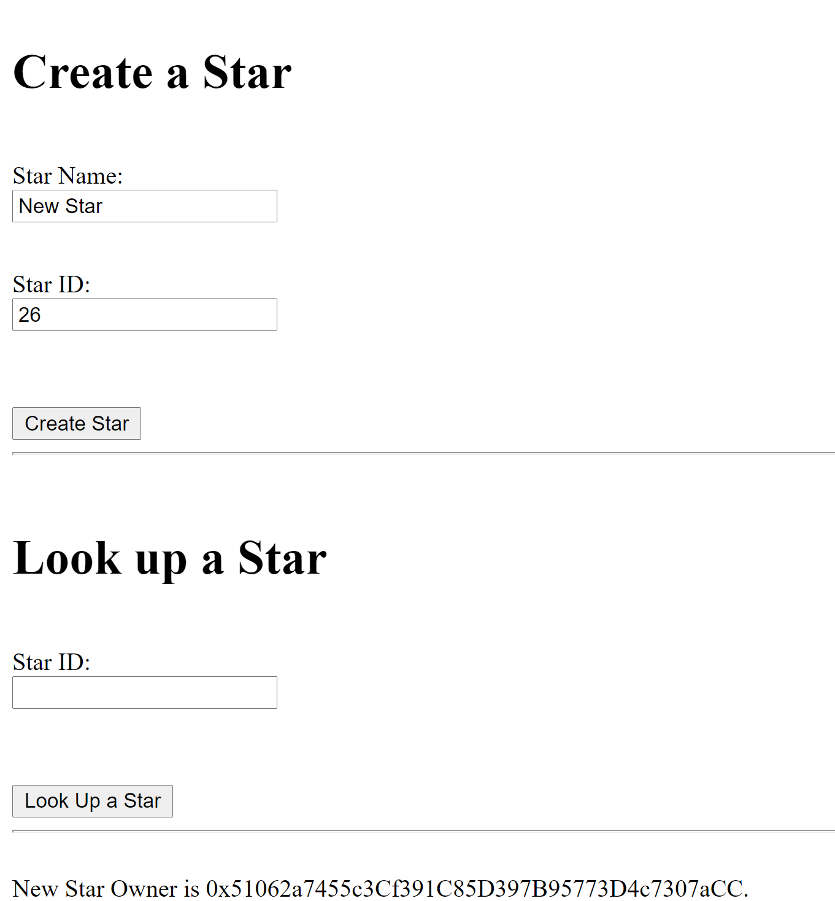
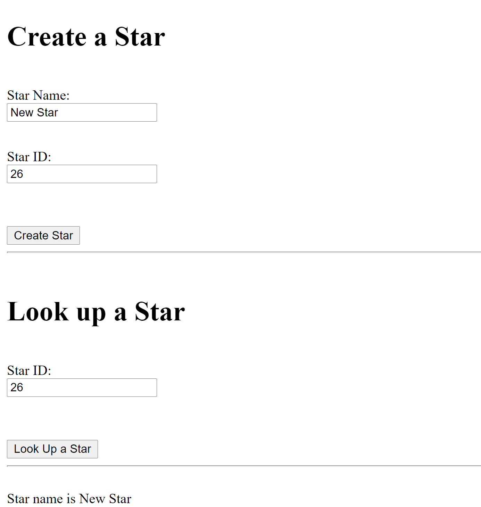

# Udacity-Build-CryptoStar-Dapp-on-Ethereum

#### Create an NFT based on a star and register it with a provided token name and symbol in this project. The test cases for the new functions were then written. The smart contract was then deployed to the public Rinkeby network.

#### Truffle v5.4.17, Node v14.17.5, Metamask already have to be installed
```bash
    cd app
    # install packages
    npm install --save  openzeppelin-solidity@2.3
    npm install --save  truffle-hdwallet-provider@1.0.17
    npm install webpack-dev-server -g
    npm install web3
```
#### In another terminal start Truffle by running
```bash
      truffle develop
      compile
      migrate --reset
      test
````

#### To start the frontend run from app folder
```bash
      cd app
      npm run dev     
```

#### To run on rinkeby testnet
```bash
     truffle migrate --reset --network rinkeby
```

 #### Once you create a star it will show the address of the star owner.
 
  
     
#### Lookup star will show the owned star name.

 


####  ERC-721 Token Name is TestStarToken

####  ERC-721 Token Symbol is TST

####  Token Address on the Rinkeby Network is 0xf4f2e1a40c976079dcbe10773c22812a171bdcb1


